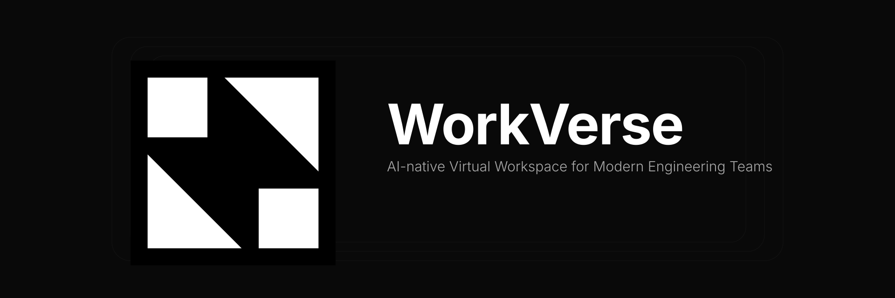
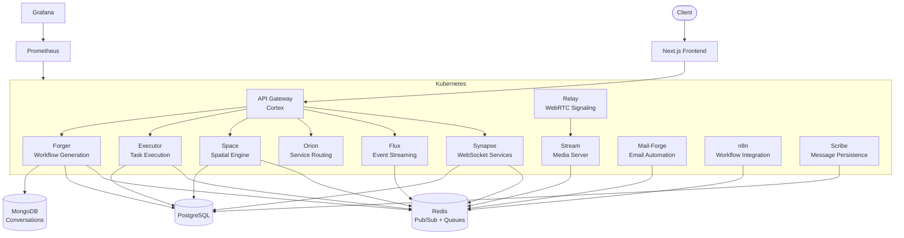

<div align="center">



***
[](https://www.typescriptlang.org/)
[](https://nextjs.org/)
[](https://bun.sh/)
[](https://www.postgresql.org/)
[](https://redis.io/)
[](https://www.docker.com/)
[](https://kubernetes.io/)
[](./LICENSE)

</div>

---

## Demo

> Demo Video

> Screenshots

---

## Why WorkVerse?

Engineering teams juggle Slack, Zoom, Jira, and countless other tools just to stay aligned. WorkVerse replaces that fragmentation with a single virtual office where teams collaborate in real-time, run AI-powered workflows, and ship faster without context switching.

Built for distributed and remote-first engineering teams that need more than just another chat app.

---

## Key Features

- **Real-time video & audio** — WebRTC-powered calls with spatial audio
- **Real-time chat** — Persistent messaging with thread support
- **Presence system** — See who's online and where they are in the workspace
- **AI-powered workflows** — Natural language commands executed by AI agents via MCP
- **Virtual workspaces** — 2D spatial engine for interactive team environments
- **Authentication** — Secure sign-in powered by Clerk
- **Role-based permissions** — Granular RBAC for teams and organizations
- **Scalable backend** — Microservices architecture built for production
- **Event-driven architecture** — Redis Pub/Sub for real-time event propagation
- **Observability** — Prometheus metrics and Grafana dashboards out of the box

---

## Architecture Overview



---

## Technology Stack

| Category | Technologies |
|---|---|
| **Frontend** | Next.js 15 · React 19 · TypeScript · Tailwind CSS · Phaser 3 |
| **Backend** | Fastify 5 · Bun · WebSockets · Redis Pub/Sub |
| **Real-time** | mediasoup (WebRTC) · WebSockets · Redis Pub/Sub |
| **Database** | PostgreSQL (Prisma) · MongoDB (Mongoose) · Redis |
| **AI** | OpenRouter SDK · Model Context Protocol (MCP) · n8n |
| **Auth** | Clerk |
| **Infrastructure** | Turborepo · Docker · Kubernetes · Helm |
| **CI/CD** | GitHub Actions · ArgoCD (GitOps) |
| **Observability** | Prometheus · Grafana |
| **Email** | Resend |

---

## Deployment

WorkVerse is deployed using a GitOps workflow:

1. **Docker** — Each service is containerized with its own Dockerfile
2. **Kubernetes** — Services run as pods in a Kubernetes cluster
3. **Helm Charts** — Configuration managed via Helm values files
4. **ArgoCD** — GitOps operator syncs cluster state from Git
5. **GitHub Actions** — CI/CD pipeline builds images, runs migrations, and updates Helm values on push to `deployment` branch

The pipeline detects changed services, builds only affected Docker images, runs Prisma migrations, and updates the staging-ops repository with new image tags.

---

## Observability

WorkVerse includes production-ready monitoring with **Prometheus** for metric collection and **Grafana** for visualization. Every service exposes metrics that are scraped by Prometheus and displayed in pre-built Grafana dashboards.

Monitoring is critical for a distributed system with 12+ microservices. It provides visibility into request latency, error rates, queue depths, and service health — enabling rapid detection and resolution of issues in production.

---

## Project Structure

```
workverse/
├── apps/
│   ├── web/                # Next.js frontend (virtual office UI)
│   ├── cortex/             # Core API server (Fastify)
│   ├── synapse/            # WebSocket & real-time services
│   ├── flux/               # Event streaming & messaging
│   ├── orion/              # Service discovery & routing
│   ├── space/              # Virtual office spatial engine
│   ├── relay/              # WebRTC signaling relay
│   ├── stream/             # Media server (mediasoup)
│   ├── executor/           # Task execution service
│   ├── forger/             # Workflow generation engine
│   ├── scribe/             # Message persistence worker
│   ├── mail-forger/        # Email automation service
│   ├── n8n/                # n8n workflow integration
│   └── docs/               # Documentation site
├── packages/
│   ├── db/                 # Prisma schema & PostgreSQL client
│   ├── redis/              # Redis client & utilities
│   ├── mcp/                # MCP server & tool registry
│   ├── queue/              # Job queue abstractions (BullMQ)
│   ├── schemas/            # Shared validation schemas (Zod)
│   ├── rbac/               # Role-based access control
│   ├── events/             # Event system (Redis Pub/Sub)
│   ├── evaluator/          # AI evaluation utilities (OpenRouter)
│   ├── convo-store/        # Conversation storage (MongoDB)
│   ├── email/              # Email templates & sending (Resend)
│   ├── ui/                 # Shared React components
│   ├── eslint-config/      # Shared ESLint configuration
│   ├── typescript-config/  # Shared TypeScript configuration
│   └── testing/            # Testing utilities
├── infra/                  # Monitoring & infrastructure configs
├── containers/             # Dockerfiles for all services
├── nginx/                  # Nginx configuration
├── turbo.json              # Turborepo task configuration
└── package.json            # Root workspace configuration
```

---

## Local Development

### Prerequisites

- **Bun** 1.1+
- **Docker** & Docker Compose

### Setup

```bash
git clone https://github.com/your-org/workverse.git
cd workverse

bun install

docker-compose up -d

bun dev
```

The frontend will be available at `http://localhost:3009`.

---

## Environment Variables

| Variable | Description | Required |
|---|---|---|
| `DATABASE_URL` | PostgreSQL connection string | Yes |
| `REDIS_HOST` | Redis host address | Yes |
| `REDIS_PORT` | Redis port | Yes |
| `CLERK_SECRET_KEY` | Clerk authentication secret | Yes |
| `OPENROUTER_API_KEY` | OpenRouter API key for LLM access | Yes |
| `N8N_ENGINE_URL` | n8n workflow engine URL | Yes |
| `NEXT_PUBLIC_CORTEX_URL` | Cortex API URL (client-side) | Yes |
| `NEXT_PUBLIC_FLUX_URL` | Flux WebSocket URL (client-side) | Yes |
| `NEXT_PUBLIC_RELAY_URL` | Relay WebSocket URL (client-side) | Yes |
| `NEXT_PUBLIC_SPACE_URL` | Space WebSocket URL (client-side) | Yes |
| `NEXT_PUBLIC_SYNAPSE_URL` | Synapse WebSocket URL (client-side) | Yes |

---

## Screenshots

> Login

> Dashboard

> Workspace

> Meeting

> AI Workflow

> Chat

---

## Future Roadmap

- [ ] Screen sharing
- [ ] Meeting recording
- [ ] Calendar integration
- [ ] Mobile app
- [ ] AI meeting summaries
- [ ] Push notifications
- [ ] Enterprise SSO + audit logs

---

## Contributing

Contributions welcome — see [CONTRIBUTING.md](./CONTRIBUTING.md).

```bash
git checkout -b feature/your-feature
git commit -m "feat: description"
git push origin feature/your-feature
```

---

## License

MIT — see [LICENSE](./LICENSE).
